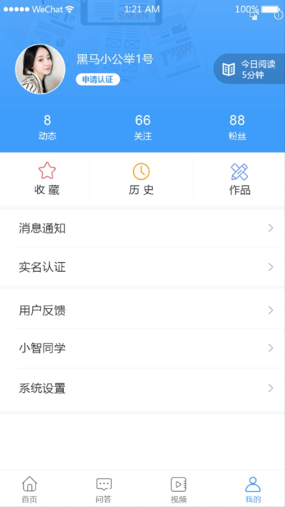
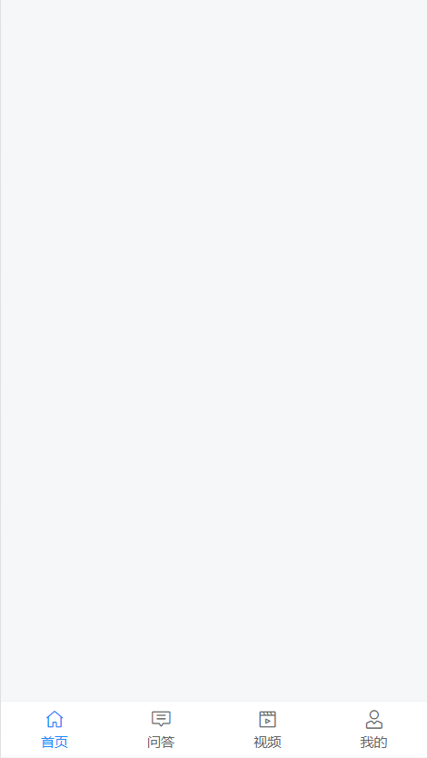
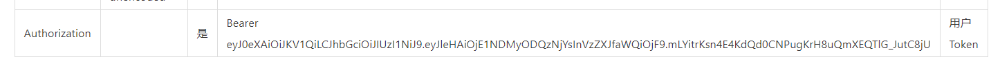
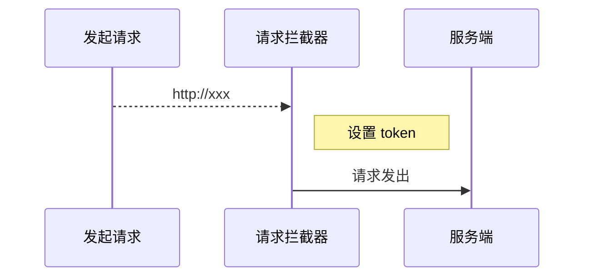

# 三、个人中心



## TabBar 处理

13：09建议暂停

通过分析页面，我们可以看到，首页、问答、视频、我的 都使用的是同一个底部标签栏，我们没必要在每个页面中都写一个，所以为了通用方便，我们可以使用 Vue Router 的嵌套路由来处理。

- 父路由：一个空页面，包含一个 tabbar，中间留子路由出口
- 子路由
  - 首页
  - 问答
  - 视频
  - 我的

### 一、创建 tabbar 组件并配置路由



这里主要使用到的 Vant 组件：

- [Tabbar 标签栏](https://youzan.github.io/vant/#/zh-CN/tabbar)

1、创建 `src/views/layout/index.vue`

```html
<template>
  <div class="layout-container">
    <!-- 子路由出口 -->
    <router-view />
    <!-- /子路由出口 -->

    <!-- 标签导航栏 -->
    <!--
      route: 开启路由模式
     -->
    <van-tabbar class="layout-tabbar" route>
      <van-tabbar-item to="/">
        <i slot="icon" class="toutiao toutiao-shouye"></i>
        <span class="text">首页</span>
      </van-tabbar-item>
      <van-tabbar-item to="/qa">
        <i slot="icon" class="toutiao toutiao-wenda"></i>
        <span class="text">问答</span>
      </van-tabbar-item>
      <van-tabbar-item to="/video">
        <i slot="icon" class="toutiao toutiao-shipin"></i>
        <span class="text">视频</span>
      </van-tabbar-item>
      <van-tabbar-item to="/my">
        <i slot="icon" class="toutiao toutiao-wode"></i>
        <span class="text">我的</span>
      </van-tabbar-item>
    </van-tabbar>
    <!-- /标签导航栏 -->
  </div>
</template>

<script>
export default {
  name: 'LayoutIndex',
  components: {},
  props: {},
  data () {
    return {
    }
  },
  computed: {},
  watch: {},
  created () {},
  mounted () {},
  methods: {}
}
</script>

<style scoped lang="less">
.layout-container {
  .layout-tabbar {
    i.toutiao {
      font-size: 40px;
    }
    span.text {
      font-size: 20px;
    }
  }
}
</style>
```

2、然后将 layout 组件配置到一级路由

```js
{
  path: '/',
  component: () => import('@/views/layout')
}
```

访问 `/` 测试。

### 二、分别创建首页、问答、视频、我的页面组件

首页组件：

```html
<template>
  <div class="home-container">首页</div>
</template>

<script>
export default {
  name: 'HomePage',
  components: {},
  props: {},
  data () {
    return {}
  },
  computed: {},
  watch: {},
  created () {},
  mounted () {},
  methods: {}
}
</script>

<style scoped></style>

```


问答组件：

```html
<template>
  <div class="qa-container">问答</div>
</template>

<script>
export default {
  name: 'QaPage',
  components: {},
  props: {},
  data () {
    return {}
  },
  computed: {},
  watch: {},
  created () {},
  mounted () {},
  methods: {}
}
</script>

<style scoped></style>

```


视频组件：

```html
<template>
  <div class="video-container">首页</div>
</template>

<script>
export default {
  name: 'VideoPage',
  components: {},
  props: {},
  data () {
    return {}
  },
  computed: {},
  watch: {},
  created () {},
  mounted () {},
  methods: {}
}
</script>

<style scoped></style>

```


我的组件：

```html
<template>
  <div class="my-container">首页</div>
</template>

<script>
export default {
  name: 'MyPage',
  components: {},
  props: {},
  data () {
    return {}
  },
  computed: {},
  watch: {},
  created () {},
  mounted () {},
  methods: {}
}
</script>

<style scoped></style>

```


### 三、将四个主页面配置为 tab-bar 的子路由

```js
{
  path: '/',
  name: 'tab-bar',
  component: () => import('@/views/tab-bar'),
  children: [
    {
      path: '', // 默认子路由
      name: 'home',
      component: () => import('@/views/home')
    },
    {
      path: 'qa',
      name: 'qa',
      component: () => import('@/views/qa')
    },
    {
      path: 'video',
      name: 'video',
      component: () => import('@/views/video')
    },
    {
      path: 'my',
      name: 'my',
      component: () => import('@/views/my')
    }
  ]
}
```

最后测试。


## 页面布局

### 未登录头部状态

```html
<template>
  <div class="my-container">
    <div class="header">
      
    </div>
    <div class="grid-nav"></div>
    <van-cell title="消息通知" is-link url="" />
    <van-cell title="实名认证" is-link url="" />
    <van-cell title="用户反馈" is-link url="" />
    <van-cell title="小智同学" is-link url="" />
    <van-cell title="系统设置" is-link url="" />
  </div>
</template>

<script>
export default {
  name: 'MyIndex',
  components: {},
  props: {},
  data () {
    return {}
  },
  computed: {},
  watch: {},
  created () {},
  mounted () {},
  methods: {}
}
</script>

<style scoped lang="less">
.my-container {
  > .header {
    height: 361px;
    background: url("~@/assets/banner.png") no-repeat;
    background-size: cover;
    display: flex;
    justify-content: center;
    align-items: center;
    .mobile-img {
      width: 132px;
      height: 132px;
    }
  }
}
</style>

```

### 关闭登录

```html
<!-- 导航栏 -->
<van-nav-bar class="page-nav" title="登录">
  <van-icon slot="left" name="cross" @click="$router.back()" />
</van-nav-bar>
```

```css
// styles>index.less
.page-nav {
  background-color: #3296fa;
  .van-nav-bar__title, .van-icon {
    color: #fff;
  }
}
```

### 已登录头部

#### 基本信息

```html
<!-- 已登录 -->
<div class="userInfo header">
  <!-- 基本信息 -->
  <div class="base">
    <div class="left">
      <van-image
                 fit="cover"
                 src="https://img.yzcdn.cn/vant/cat.jpeg"
                 class="avatar"
                 round
                 />
      <span class="name">黑马头条</span>
    </div>
    <div class="right">
      <van-button type="default" size="mini" round>编辑资料</van-button>
    </div>
  </div>
  <!-- 粉丝、关注 -->
  <div class="data"></div>
</div>
```

```css
.header {
    width: 750px;
    height: 401px;
    background: url('~@/assets/banner.png');
    background-size: cover;
  }
.userInfo {
    background: red;
    .base {
      height: 231px;
      padding: 76px 32px 23px;
      background: #ccc;
      display: flex;
      justify-content: space-between;
      align-items: center;
      box-sizing: border-box;
      .left {
        display: flex;
        align-items: center;
        .avatar {
          width: 132px;
          height: 132px;
          border: 2px solid #fff;
        }
        .name {
          font-size: 29px;
          margin-left: 22px;
        }
      }
    }
  }
```

#### 粉丝、关注

```html
<div class="data">
  <div class="data-item">
    <span>90</span>
    <span>头条</span>
  </div>
  <div class="data-item">
    <span>90</span>
    <span>关注</span>
  </div>
  <div class="data-item">
    <span>90</span>
    <span>粉丝</span>
  </div>
  <div class="data-item">
    <span>90</span>
    <span>获赞</span>
  </div>
</div>
```

```css
.data {
  display: flex;
  justify-content: space-around;
  .data-item {
    height: 130px;
    display: flex;
    align-items: center;
    justify-content: center;
    flex-direction: column;
    color: #fff;
    span:nth-child(1) {
      font-size: 36px;
      margin-bottom: 15px;
    }
    span:nth-child(2) {
      font-size: 23px;
    }
  }
}
```

### 宫格导航

1. 结构

```html
<!-- 宫格 -->
<van-grid class="nav-grid" :column-num="2" clickable >
  <van-grid-item text="收藏">
    <i slot="icon" class="toutiao toutiao-shoucang"></i>
    <span class="text" slot="text">收藏</span>
  </van-grid-item>
  <van-grid-item text="文字">
    <i slot="icon" class="toutiao toutiao-lishi"></i>
    <span class="text" slot="text">历史</span>
  </van-grid-item>
</van-grid>
```

2. 样式

```css
.nav-grid {
  background: #fff;
  .toutiao {
    font-size: 45px;
  }
  .toutiao-shoucang {
    color: #EB5253;
  }
  .toutiao-lishi {
    color: #FF9D1D;
  }
  .text {
    color: #000;
    margin-top: 8px;
    font-size: 28px;
  }
}
```

### 单元格导航

```html
<van-cell title="消息通知" is-link />
<van-cell title="小智同学" is-link />
<van-cell class="logout-cell" title="退出登录" center/>
```

```css
.logout-cell {
  height: 100px;
  text-align: center;
  color: #EB5253;
  margin: 10px 0;
  font-size: 30px;
}
```

## 处理已登录和未登录的页面展示

1. 获取vuex中的user

   ```js
   import { mapState } from 'vuex'
   export default {
     name: 'my',
     data () {
       return {
   
       }
     },
   
     computed: {
       ...mapState(['user'])
     },
   
     created () {
   
     },
   
     methods: {
   
     }
   }
   </script>
   ```

2. 通过user处理显示登录结构和未登录结构

   ```html
   <!-- 已登录 -->
   <div v-if="user" class="userInfo header">
   </div>
   <!-- 未登录 -->
   <div v-else class="header not-login">
   </div>
   <!-- 退出 -->
   <van-cell v-if="user" class="logout-cell" title="退出登录" center/>
   ```

## 用户退出


1、给退出按钮注册点击事件

```html
<van-cell @click="onLogout" v-if="user" class="logout-cell" title="退出登录" center/>
```

2、退出处理

```js
onLogout () {
  // 退出提示
  // 在组件中需要使用 this.$dialog 来调用弹框组件
  this.$dialog.confirm({
    title: '确认退出吗？'
  }).then(() => {
    // on confirm
    // 确认退出：清除登录状态（容器中的 user + 本地存储中的 user）
    this.$store.commit('setUser', null)
  }).catch(() => {
    // on cancel
    console.log('取消执行这里')
  })
}
```

3、添加clickable点击效果

最后测试。

## 展示登录用户信息


步骤：

- 封装接口
- 请求获取数据
- 模板绑定

1、在 `api/user.js` 中添加封装数据接口

```js
import store from '@/store'

/**
 * 获取用户自己的信息
 */
export const getUserInfo = () => {
  return request({
    method: 'GET',
    url: '/app/v1_0/user',
    // 发送请求头数据
    headers: {
      // 注意：该接口需要授权才能访问
      //       token的数据格式：Bearer token数据，注意 Bearer 后面有个空格
      Authorization: `Bearer ${store.state.user.token}`
    }
  })
}

```

2、在 `views/my/index.vue` 请求加载数据

```js
+ import { getUserInfo } from '@/api/user'

export default {
  name: 'MyPage',
  components: {},
  props: {},
  data () {
    return {
+      userInfo: {} // 用户信息
    }
  },
  computed: {
    ...mapState(['user'])
  },
  watch: {},
+++  created () {
    // 初始化的时候，如果用户登录了，我才请求获取当前登录用户的信息
    if (this.user) {
      this.loadUser()
    }
  },
  mounted () {},
  methods: {
+++ async loadUser () {
      try {
        const { data } = await getUserInfo()
        this.userInfo = data.data
      } catch (err) {
        console.log(err)
        this.$toast('获取数据失败')
      }
    }
  }
}
```

3、模板绑定

```html
<!-- 已登录 -->
    <div v-if="user" class="userInfo header">
      <!-- 基本信息 -->
      <div class="base">
        <div class="left">
          <van-image
                    fit="cover"
                    :src="userInfo.photo"
                    class="avatar"
                    round
                    />
          <span class="name">{{ userInfo.name }}</span>
        </div>
        <div class="right">
          <van-button type="default" size="mini" round>编辑资料</van-button>
        </div>
      </div>
      <!-- 粉丝、关注 -->
      <div class="data">
        <div class="data-item">
          <span>{{ userInfo.art_count }}</span>
          <span>头条</span>
        </div>
        <div class="data-item">
          <span>{{ userInfo.follow_count }}</span>
          <span>关注</span>
        </div>
        <div class="data-item">
          <span>{{ userInfo.fans_count }}</span>
          <span>粉丝</span>
        </div>
        <div class="data-item">
          <span>{{ userInfo.like_count }}</span>
          <span>获赞</span>
        </div>
      </div>
    </div>
```


## 优化设置 Token

项目中的接口除了登录之外大多数都需要提供 token 才有访问权限。

通过接口文档可以看到，后端接口要求我们将 token 放到请求头 `Header` 中并以下面的格式发送。



> 字段名称：`Authorization`
>
> 字段值：`Bearer token`，注意 `Bearer` 和 `token` 之间有一个空格

方式一：在每次请求的时候手动添加（麻烦）。

```js
axios({
  method: "",
  url: "",
  headers: {
    Authorization: "Bearer token"
  }
})
```

方式二：使用请求拦截器统一添加（推荐，更方便）。



在 `src/utils/request.js` 中添加拦截器统一设置 token：

```js
/**
 * 请求模块
 */
import axios from 'axios'
import store from '@/store'

const request = axios.create({
  baseURL: 'http://ttapi.research.itcast.cn/' // 接口的基准路径
})

// 请求拦截器
// Add a request interceptor
request.interceptors.request.use(function (config) {
  // Do something before request is sent
  // config ：本次请求的配置对象
  // config 里面有一个属性：headers
  const { user } = store.state
  if (user && user.token) {
    config.headers.Authorization = `Bearer ${user.token}`
  }
  return config
}, function (error) {
  // Do something with request error
  return Promise.reject(error)
})

// 响应拦截器

export default request

```

api》user.js注释掉store和获取用户信息携带的请求头

```js
import request from '@/utils/request'
// import store from '@/store'

/**
 * 获取用户自己的信息
 */
export const getUserInfo = () => {
  return request({
    method: 'GET',
    url: '/app/v1_0/user',
    // 发送请求头数据
    // headers: {
    //   // 注意：该接口需要授权才能访问
    //   //       token的数据格式：Bearer token数据，注意 Bearer 后面有个空格
    //   Authorization: `Bearer ${store.state.user.token}`
    // }
  })
}
```


