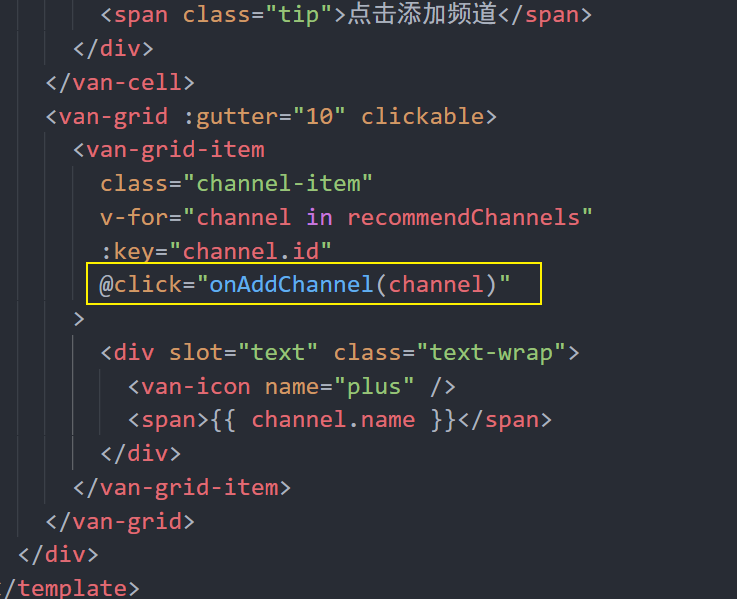
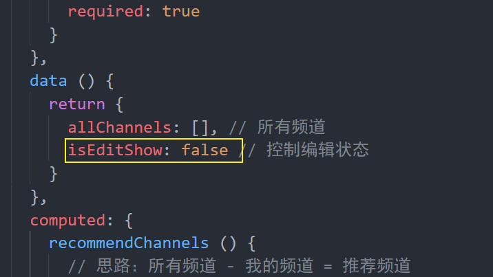
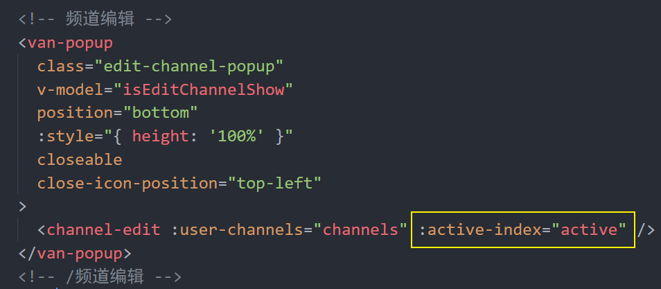
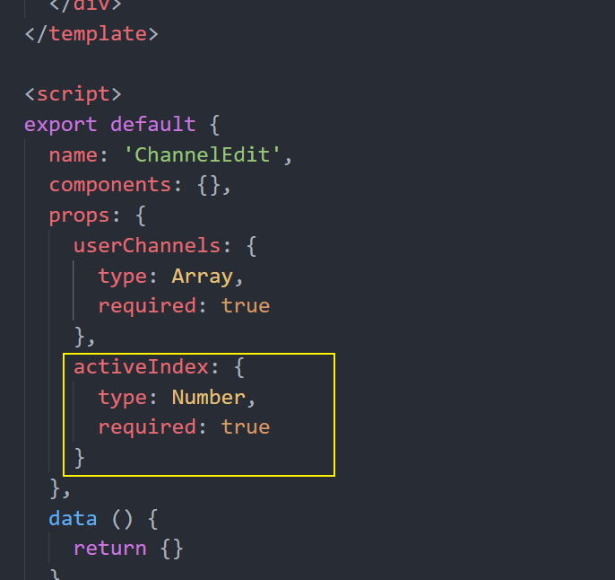

# 五、首页—频道编辑


## 5.1 处理页面弹出层

Vant 中内置了 [Popup 弹出层](https://youzan.github.io/vant/#/zh-CN/popup) 组件。

1、在 `data`中添加一个数据用来控制弹层的显示和隐藏

```js
data () {
  return {
    ...
    isChannelEditShow: true // 这里我们先设置为 true 就能看到弹窗的页面了
  }
}
```

2、然后在首页模板中的频道列表后面添加弹出层组件

```html
<!-- 频道编辑 -->
<van-popup
  class="edit-channel-popup"
  v-model="isEditChannelShow"
  position="bottom"
  :style="{ height: '100%' }"
  closeable
  close-icon-position="top-left"
>内容</van-popup>
<!-- /频道编辑 -->
```

```less
.edit-channel-popup {
  padding-top: 100px;
	box-sizing: border-box;
}
```

3、点击汉堡按钮修改isEditChannelShow

```html
<div slot="nav-right" class="hamburger-btn">
    <i @click="isEditChannelShow = true" class="toutiao toutiao-gengduo"></i>
</div>
```


## 5.2 创建频道编辑组件

1、创建 `views/home/components/channel-edit.vue`

```html
<template>
  <div class="channel-edit">频道编辑</div>
</template>

<script>
export default {
  name: 'ChannelEdit',
  components: {},
  props: {},
  data () {
    return {}
  },
  computed: {},
  watch: {},
  created () {},
  mounted () {},
  methods: {}
}
</script>

<style scoped lang="less"></style>

```

2、在首页中加载注册

```js
import ChannelEdit from './components/channel-edit'
```

```js
export default {
  ...
  components: {
    ...
    ChannelEdit
  }
}
```

3、在弹出层中使用频道编辑组件

```html
<!-- 频道编辑 -->
<van-popup
  v-model="isChannelEditShow"
  position="bottom"
  closeable
  close-icon-position="top-left"
  :style="{ height: '100%' }"
>
+  <channel-edit />
</van-popup>
<!-- /频道编辑 -->
```

## 5.3 页面布局

```html
<template>
  <div class="channel-edit">
    <van-cell title="我的频道" :border="false">
      <van-button
        size="mini"
        round
        type="danger"
        plain
      >编辑</van-button>
    </van-cell>
    <van-grid :gutter="10">
      <van-grid-item
        class="channel-item"
        v-for="value in 8"
        :key="value"
        text="文字"
      />
    </van-grid>
    <van-cell title="频道推荐" :border="false"></van-cell>
    <van-grid :gutter="10">
      <van-grid-item
        class="channel-item"
        v-for="value in 8"
        :key="value"
        text="文字"
      />
    </van-grid>
  </div>
</template>

<script>
export default {
  name: 'ChannelEdit',
  components: {},
  props: {},
  data () {
    return {}
  },
  computed: {},
  watch: {},
  created () {},
  mounted () {},
  methods: {}
}
</script>

<style scoped lang="less">

</style>

```

## 5.4 样式调整

6：30暂停

### 5.4.1 实现基本样式

1、默认样式

```css
.channel-edit {
  .channel-item {
    height: 86px;
    /deep/ .van-grid-item__content {
      background-color: #f5f5f6;
      .van-grid-item__text {
        color: #222;
        font-size: 28px;
      }
    }
  }
}
```

### 5.4.2 推荐频道+号处理

```html
<van-grid class="recommend-grid" :gutter="10">
        <van-grid-item
          class="channel-item"
          v-for="value in 8"
          :key="value"
          text="文字字"
          icon="plus"
        />
      </van-grid>
```

```css
/deep/ .recommend-grid {
    .van-grid-item__content {
        flex-direction: row;
        color: #222;
        .van-icon {
            font-size: 24px;
        }

        .van-grid-item__text {
            font-size: 28px;
            margin-top: 0;
        }
    }
}
```

### 5.4.3 我的频道右上角关闭图标

```html
<van-grid :gutter="10">
    <van-grid-item
                   class="channel-item"
                   v-for="value in 8"
                   :key="value"
                   text="文字"
                   icon="close"
                   />
</van-grid>
```

```css
/deep/ .van-icon-close {
    position: absolute;
    right: -10px;
    top: -10px;
    font-size: 36px;
    color: #ccc;
}
```


## 5.5 展示我的频道

1、在父组件中把 `channels` 传递给频道编辑组件

```html
<!-- 频道编辑 -->
    <van-popup
      class="edit-channel-popup"
      v-model="isEditChannelShow"
      position="bottom"
      :style="{ height: '98%' }"
      closeable
      close-icon-position="top-left"
    >
      <!-- 传递channels -->
      <channel-edit :myChannels="channels" />
    </van-popup>
    <!-- /频道编辑 -->
```


2、在频道编辑组件中声明接收父组件的 `userChannels` 频道列表数据并遍历展示

```js
name: 'channel-edit',
  props: {
    myChannels: {
      type: Array,
      required: true
    }
  }
```

```html
<!-- 我的频道 -->
<van-grid :gutter="10">
    <van-grid-item
                   class="channel-item"
                   v-for="(channelItem, index) in myChannels"
                   :key="index"
                   :text="channelItem.name"
                   icon="close"
                   />
</van-grid>
```


## 5.6 处理激活频道高亮

1、讲首页的active传递给编辑频道组件

```html
<!-- 传递channels 传递active高亮索引-->
<channel-edit :active="active" :myChannels="channels" />
```

2、编辑频道组件接收数据

```js
props: {
    myChannels: {
      type: Array,
      required: true
    },
    active: {
      type: Number,
      required: true
    }
  }
```

3、修改结构，根据active设置高亮类名

```html
<van-grid-item
               class="channel-item"
               v-for="(channelItem, index) in myChannels"
               :key="index"
               icon="close"
               >
    <span class="text" :class="{active: active === index}" slot="text">{{ channelItem.name }}</span>
</van-grid-item>
```

4、添加active样式，和text样式

```css
/deep/ .van-grid-item__content {
      background-color: #f5f5f6;
      .van-grid-item__text, .text {
        color: #222;
        font-size: 28px;
        white-space: nowrap;
      }

      .active {
        color: red;
      }
    }
```

## 5.7 展示推荐频道列表


没有用来获取推荐频道的数据接口，但是我们有获取所有频道列表的数据接口。

所以：`所有频道列表 - 我的频道 = 剩余推荐的频道`。

实现过程所以一共分为两大步：

- 获取所有频道
- 基于所有频道和我的频道计算获取剩余的推荐频道

### 5.7.1 获取所有频道

1、封装数据接口

```js
/**
 * 获取所有频道
 */
export const getAllChannels = () => {
  return request({
    method: 'GET',
    url: '/app/v1_0/channels'
  })
}
```

2、引入getAllChannels

```js
import { getAllChannels } from '@/api/article.js'
```

3、在编辑频道组件中请求获取所有频道数据

```js
methods: {
    // 加载所有频道
    async loadAllChannels () {
      try {
        const { data } = await getAllChannels()
        this.allChannels = data.data.channels
      } catch (err) {
        this.$toast('获取频道列表数据失败')
      }
    }
  }
```

4、调用该方法，并初始化channels

```js
data () {
    return {
      allChannels: []
    }
  },
  created () {
    this.loadAllChannels()
  },
```

5、在调试工具中测试是否有拿到数据

### 5.7.2 处理展示推荐频道

思路：`所有频道 - 用户频道 = 推荐频道`

1、封装计算属性筛选数据

```js
recommendChannels () {
    return this.allChannels.filter(channel => {
        const mychannel = this.myChannels.find(myChannel => {
            return myChannel.id === channel.id
        })
        return !mychannel
    })
}
```

- 遍历所有频道
- 对每一个频道都判断：该频道是否属于我的频道
- 如果不属于我的频道，则收集起来
- 直到遍历结束，剩下来就是那些剩余的推荐频道

2、模板绑定

```html
<van-grid class="recommend-grid" :gutter="10">
        <van-grid-item
          class="channel-item"
          v-for="channel in recommendChannels"
          :key="channel.id"
          :text="channel.name"
          icon="plus"
        />
      </van-grid>
```

## 5.8 添加频道


思路：

- 给推荐频道列表中每一项注册点击事件
- 获取点击的频道项
- 将频道项添加到我的频道中
- ~~将当前点击的频道项从推荐频道中移除~~
  - 不需要删除，因为我们获取数据使用的是计算属性，当我频道发生改变，计算属性重新求值了

1、给推荐频道中的频道注册点击事件



2、在添加频道事件处理函数中


然后你会神奇的发现点击的那个推荐频道跑到我的频道中了，我们并没有去手动的删除点击的这个推荐频道，但是它没了！

主要是因为推荐频道是通过一个计算属性获取的，计算属性中使用了 channels（我的频道）数据，所以只要我的频道中的数据发生变化，那么计算属性就会重新运算获取最新的数据。

## 5.9 编辑频道

思路：

- 给我的频道中的频道项注册点击事件
- 在事件处理函数中
  - 如果是编辑状态，则执行删除频道操作
  - 如果是非编辑状态，则执行切换频道操作

### 5.9.1 处理编辑状态

1、在 data 中添加数据用来控制编辑状态的显示



2、在我的频道项中添加删除图标

```html
<van-grid :gutter="10">
        <van-grid-item
          class="channel-item"
          v-for="(channelItem, index) in myChannels"
          :key="index"
        >
          <span class="text" :class="{active: active === index}" slot="text">{{ channelItem.name }}</span>
          <!-- 通过插槽自定义图标 -->
          <van-icon v-show="isEdit" slot="icon" name="close" />
        </van-grid-item>
      </van-grid>
```

```css
.van-grid-item__icon-wrapper {
        position: unset;
      }
```


3、处理点击编辑按钮

```html
<van-cell title="我的频道" :border="false">
        <van-button
          size="mini"
          round
          type="danger"
          plain
          @click="isEdit = !isEdit"
        >{{ isEdit ? '完成': '编辑' }}</van-button>
      </van-cell>
```

4、控制推荐不删除

```html
<van-icon v-show="isEdit && index!==0" slot="icon" name="close" />
```

### 5.9.2 切换频道

#### 5.9.2.1 切换频道功能

功能需求：在非编辑器状态下切换频道。

1、给我的频道项注册点击事件

```html
<van-grid-item
          class="channel-item"
          v-for="(channelItem, index) in myChannels"
          :key="index"
          @click="onMyChannelClick(channelItem, index)"
        >
          <span class="text" :class="{active: active === index}" slot="text">{{ channelItem.name }}</span>
          <!-- 通过插槽自定义图标 -->
          <van-icon v-show="isEdit && index!==0" slot="icon" name="close" />
        </van-grid-item>
```

2、处理函数

```js
// 点击我的频道
    onMyChannelClick (channelItem, index) {
      if (this.isEdit) {
        // 执行删除操作
      } else {
        // 执行跳转操作
        this.$emit('update-active', index)
      }
    }
```

3、在父组件中监听处理自定义事件

```html
<!-- 传递channels 传递active高亮索引 定义update-active事件-->
<channel-edit @update-active="onUpdateActive" :active="active" :myChannels="channels" />
```

4、定义事件函数

```js
onUpdateActive (index) {
    this.active = index
    this.isEditChannelShow = false
}
```


#### 5.9.2.1 让激活频道高亮

思路：

- 将首页中的激活的标签索引传递给频道编辑组件
- 在频道编辑组件中遍历我的频道列表的时候判断遍历项的索引是否等于激活的频道标签索引，如果一样则作用一个高亮的 CSS 类名


1、将首页组件中的 `active` 传递到频道编辑组件中



2、在频道编辑组件中声明 props 接收



3、判断遍历项，如果 `遍历项索引 === active`，则给这个频道项设置高亮样式


### 5.9.3 删除频道

10:21建议暂停：完成删除操作

功能需求：在编辑状态下删除频道。

1、完善执行删除操作

```js
// 点击我的频道
onMyChannelClick (channelItem, index) {
    if (this.isEdit) {
        // 执行删除操作
        if (index <= this.active) {
            this.$emit('update-active', this.active - 1, true)
        }
        this.myChannels.splice(index, 1)
    } else {
        // 执行跳转操作
        this.$emit('update-active', index, false)
    }
}
```

2、完善update-active方法

```js
onUpdateActive (index, isEditChannelShow) {
      this.active = index
      this.isEditChannelShow = isEditChannelShow
    }
```

3、判断是否为推荐

```js
// 点击我的频道
    onMyChannelClick (channelItem, index) {
      if (this.isEdit) {
        // 执行删除操作
        // 判断是否为推荐
        if (index === 0) return
        if (index <= this.active) {
          this.$emit('update-active', this.active - 1, true)
        }
        this.myChannels.splice(index, 1)
      } else {
        // 执行跳转操作
        this.$emit('update-active', index, false)
      }
    }
```


## 5.10 频道数据持久化

### 5.10.1 业务分析

频道编辑这个功能，无论用户是否登录用户都可以使用。

不登录也能使用

- 数据存储在本地
- 不支持同步功能

登录也能使用

- 数据存储在线上后台服务器
- 更换不同的设备可以同步数据

### 5.10.2 添加频道

6：44建议暂停

思路：

- 如果未登录，则存储到本地
- 如果已登录，则存储到线上
  - 找到数据接口
  - 封装请求方法
  - 请求调用

1、导入vuex中的mapState、storage中的方法

```js
import { mapState } from 'vuex'
import { setItem } from '@/utils/storage.js'
```

```js
computed: {
    recommendChannels () {
        return this.allChannels.filter(channel => {
            const mychannel = this.myChannels.find(myChannel => {
                return myChannel.id === channel.id
            })
            return !mychannel
        })
    },
    // 获取user
    ...mapState(['user'])
},
```

2、根据user判断是否登陆

```js
// 点击添加频道
onAddChannel (channels) {
    this.myChannels.push(channels)
    if (this.user) {
        // 已登录
    } else {
        // 未登陆
        setItem('TOUTIAO_CHANNELS', this.myChannels)
    }
}
```

3、如果已登录，封装添加频道的请求方法

```js
/**
 * 添加用户频道
 */
export const addUserChannel = channel => {
  return request({
    method: 'PATCH',
    url: '/app/v1_0/user/channels',
    data: {
      channels: [channel]
    }
  })
}
```

4、引入addUserChannel方法

5、修改添加频道的处理逻辑

```js
// 点击添加频道
async onAddChannel (channels) {
    this.myChannels.push(channels)
    if (this.user) {
        try {
            // 已登录，数据存储到线上
            await addUserChannel({
                id: channels.id, // 频道 id
                seq: this.myChannels.length // 频道的 序号
            })
            this.$toast('添加成功')
        } catch (err) {
            this.$toast('保存失败')
        }
    } else {
        // 未登陆
        setItem('TOUTIAO_CHANNELS', this.myChannels)
    }
}
```

### 5.10.3 删除频道

思路：

- 如果未登录，则存储到本地
- 如果已登录，则存储到线上
  - 找到数据接口
  - 封装请求方法
  - 请求调用


1、封装删除用户频道请求方法

```js
/**
 * 删除用户频道
 */
export const deleteUserChannel = channelId => {
  return request({
    method: 'DELETE',
    url: `/app/v1_0/user/channels/${channelId}`
  })
}
```

2、在**onMyChannelClick**函数中执行删除操作最后面调用删除持久化的方法

```js
// 点击我的频道
onMyChannelClick (channelItem, index) {
    if (this.isEdit) {
        // 执行删除操作
        if (index === 0) return
        if (index <= this.active) {
            this.$emit('update-active', this.active - 1, true)
        }
        this.myChannels.splice(index, 1)
        // 删除数据持久化
        this.deleteChannel(channelItem)
    } else {
        // 执行跳转操作
        this.$emit('update-active', index, false)
    }
}
```

3、定义deleteChannel方法

```js
async deleteChannel (channel) {
  try {
    if (this.user) {
      // 已登录，将数据存储到线上
      await deleteUserChannel(channel.id)
    } else {
      // 未登录，将数据存储到本地
      setItem('channles', this.userChannels)
    }
  } catch (err) {
    console.log(err)
    this.$toast('删除频道失败，请稍后重试')
  }
}
```


## 5.11 正确的获取首页频道列表数据


> 提示：获取登录用户的频道列表和获取默认推荐的频道列表是同一个数据接口。后端会根据接口中的 token 来判定返回数据。

1、导入mapstate获取user

```js
import { mapState } from 'vuex'

computed: {
    ...mapState(['user'])
},
```

```js
async loadChannels () {
  try {
    let channels = []
    if (this.user) {
      // 已登录，请求获取线上的频道数据
      const { data } = await getChannels()
      channels = data.data.channels
    } else {
      // 未登录
      const localChannels = getItem('channels')
      if (localChannels) {
        // 有本地频道数据，则使用
        channels = localChannels
      } else {
        // 没有本地频道数据，则请求获取默认推荐的频道列表
        const { data } = await getChannels()
        channels = data.data.channels
      }
    }

    // 将数据更新到组件中
    this.channels = channels
  } catch (err) {
    console.log(err)
    this.$toast('数据获取失败')
  }
},
```

2、优化loadChannels

```js
async loadChannels () {
    try {
        let channles = []
        const localChannels = getItem('TOUTIAO_CHANNELS')
        if (this.user || !localChannels) {
            // 登录 或者 本地没有存储 获取后端数据
            const { data } = await getUserChannels()
            this.channels = data.data.channels
            return false
        } else {
            // 未登录并且本地没有数据
            channles = localChannels
        }
        this.channels = channles
    } catch (err) {
        this.$toast('获取频道列表数据失败')
    }
}
```

